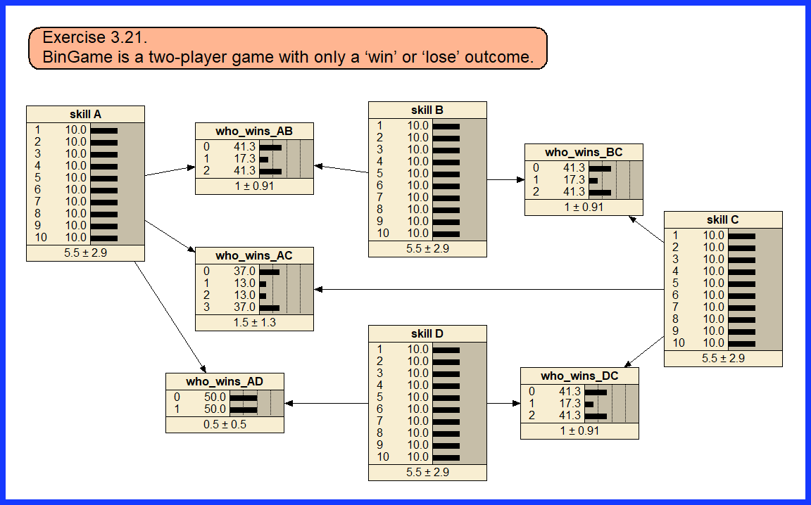

# bingame-bayesian-network
A Netica implementation of Barber’s BinGame exercise, inferring hidden player skill from binary game outcomes.

# BinGame Bayesian Network

A Netica implementation of the **BinGame** exercise (chapter 3.21) from David Barber’s *Bayesian Reasoning and Machine Learning*.

This small Bayesian network models a tournament with four players whose **skill levels are hidden** and whose **win/loss outcomes are observed**. The model updates posterior beliefs about player skill after entering the observed game results.

## Files

- `bingame.dne` — Netica model
- `bingame-network.png` — screenshot of the network
- `bingame-blog-header.png` — illustration for the blog post

## Problem

There are four players: **A, B, C, D**.

Observed outcomes:

- A beat B twice
- B beat C twice
- A beat C twice
- C beat A once
- C beat D twice

Each player has a hidden skill level from 1 to 10.

The win probability is modeled as:

\[
P(A \text{ beats } B) = \frac{1}{1 + \exp(s_B - s_A)}
\]

## What this model shows

- hidden-variable modeling
- inference from sparse observations
- dependence induced by conditioning on shared outcomes
- how naturally this kind of problem can be represented in Netica

## Why this repo exists

Barber presents this exercise computationally in Matlab. This version shows how directly the same structure can be built and explored in **Netica**, with immediate visual updating after entering evidence.

## Screenshot

## Source

Inspired by Exercise 3.21 in David Barber’s *Bayesian Reasoning and Machine Learning*.

## License

MIT
